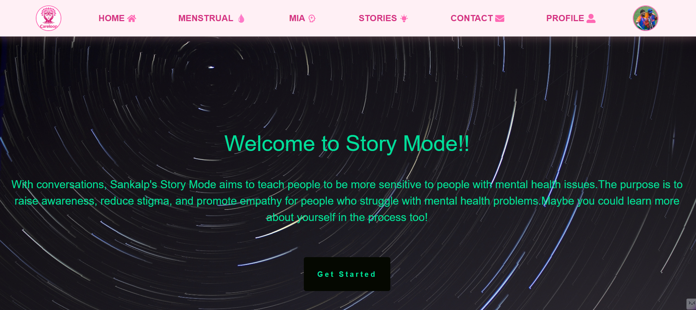
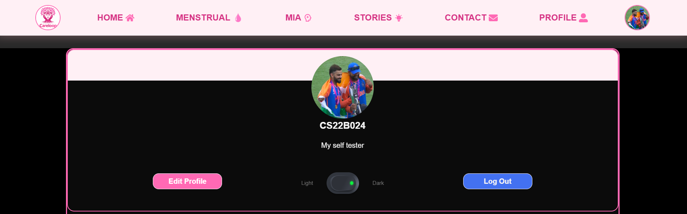

# Sankalp

Use the app [here](https://sankalp-one.vercel.app)!

Check out demo [here](https://youtu.be/ZZddluzInkI?si=R0ijkjIWCf1E_gb_)!

This GitHub repository is available [here](https://github.com/ChandradithyaJ/Sankalp)!

## Table of Contents

- [Project Overview](#project-overview)
- [Problem Statement](#problem-statement)
- [Application Features](#application-features)
  - [Story Mode](#story-mode)
  - [Badges](#badges)
  - [User Authentication](#user-authentication)
  - [Report and Suggestion](#report-and-suggestion)
  - [Dark Mode](#dark-mode)
  - [Live News Feed](#live-news-feed)
  - [Therapy Chatbot](#therapy-chatbot)
  -  [Period Predictor](#period-predictor)
  -  [AI Chat Assistant (Period-related Queries)](#ai-chat-assistant-period-related-queries)
- [Setting up](#setting-up-a-server)
  - [Environment Configuration](#environment-configuration)
- [Usage](#usage)
- [Technologies Used](#technologies-used)
- [License](#license)
- [Contact](#contact)

## Project Overview

CareLoop is a health and wellness tracking app focused on improving the lives of rural women. It provides a clean, accessible, and secure platform to track menstrual health, symptoms, and general wellness data. The app uses the MERN stack and incorporates modern design principles to ensure usability even in resource-constrained environments.

## Problem Statement
Access to healthcare and preventive care remains a significant challenge for many, especially in underserved and rural communities. Barriers such as lack of awareness, social stigma, and limited healthcare infrastructure prevent individuals—particularly women—from receiving timely information and support for menstrual and reproductive health. These gaps contribute to poor health outcomes and emotional distress.

Our application addresses this problem by creating a digital platform that improves access to healthcare information and preventive care with a strong focus on digital accessibility. Through features like the Periods Predictor and AI Chat Assistant, the app empowers users with easy-to-use, culturally sensitive tools and reliable information, helping bridge the gap in healthcare access and promote better health and well-being.

## Application Features

### Story Mode

- Users can explore the experiences of individuals with mental health issues and disabilities.
- Modules provide module descriptions and track user progress.
- Provides insights into how users' words and actions can positively or negatively affect others.
- If a disrespectful option is chosen in the story mode, the app encourages users to reconsider or provides an explanation for the inappropriateness.
- Badges provided for completion of stories.
- Get at least 80% of the total score the successfully finish the story

### Badges
  - Recognition for user achievements, like completion of stories.
  
  

### User Authentication

- Basic login, logout, and registration functionality.
- Secure storage of user data and preferences.
- Allows users to personalize their profiles with customizable profile pictures.

### Report and Suggestion

- Allows users to report issues or suggest improvements directly to the development team.

### Dark Mode

- Enables users to customize the app's theme with light or dark mode.

### Live News Feed
- Keeps users informed with recent news on mental health and related matters.

### Therapy Chatbot
-  Integration of a chatbot to assist users in understanding concepts related to mental health and disabilities

### Period Predictor
- The Periods Predictor feature in our application is designed to assist women—especially in rural areas—in tracking their menstrual cycles accurately and privately. By allowing users to input basic information such as their last period date and average cycle length, the predictor estimates upcoming cycles, fertile windows, and safe days. This helps promote reproductive health awareness and reduce stigma around menstruation. The tool is lightweight, accessible with minimal internet connectivity, and respects user privacy, making it especially useful in underserved communities.

### AI Chat Assistant (Period-related Queries)
- The AI Chat Assistant for Period-related Queries is an intelligent, user-friendly feature that provides instant support for menstruation-related concerns. It allows users to ask questions about menstrual health, hygiene practices, pain relief methods, irregular cycles, and more in a conversational format. Designed to be empathetic and informative, the assistant aims to bridge the knowledge gap in areas where access to reliable health information is limited. By offering multilingual and culturally sensitive responses, it empowers users with accurate, personalized guidance while maintaining privacy and ease of access.

## Setting up a server

To set up and run the Sankalp MERN Web Application locally, follow these steps:

1. Clone this repository to your local machine: `git clone https://github.com/ChandradithyaJ/Sankalp.git`.
2. Navigate to the project folder: `cd sankalp`.
3. Install root dependencies: `npm install`. Or copy paste the following code `npm i concurrently`
4. Change directory to the client folder: `cd client`.
5. Install client dependencies: `npm install`. Or copy paste the following code `npm i @fortawesome/free-solid-svg-icons @fortawesome/react-fontawesome @fvilers/disable-react-devtools axios fontawesome gsap lottie-react picomatch postcss-preset-env react react-carousel3 react-device-detect react-dom react-icons react-jwt react-responsive-carousel react-router-dom react-scripts swiper web-vitals @iconify/react`
6. Return to the project folder: `cd ..`.
7. Change directory to the server folder: `cd server`. 8. Install server dependencies: `npm install`. Or copy paste the following code `npm i axios bcrypt bing-translate-api cloudinary cors dotenv express jsonwebtoken mongodb mongoose netlify-lambda qs serverless-http`

### Environment Configuration

1. Navigate to the Server Directory
2. Copy the `.env.sample` file to a new file named `.env`
3. Modify the values in the `.env` file to match your configuration needs.
4. In the client/src/UserProfile/UpdateProfile.js, in the handleSubmit function: change the `newProfilePic` variable to the link which will be generated by Cloudinary
5. In the server/controllers/picController.js, in the updateProfilePic function: change the `upload_preset` variable to the Cloudinary upload_preset where you store your pics
6. Please note that for the Story Mode to work, you need stories in the database which will be provided in JSON format soon. Please load them into your Mongo as per the specific instructions mentioned.

## Usage

1. Start the server and client concurrently using: `npm run start` in the root directory.
2. Access the app in your web browser at `http://localhost:3000`.

## Technologies Used
1. MERN
   - Mongo as the database
   - Node (using ExpressJS) for the Backend
   - ReactJS for the frontend
2. [News API](https://newsapi.org)
3. [Cloudinary API](https://cloudinary.com)
     - for storing the profile pics of users
4. Bootstrap (parts of the UI)
5. Lottie animations
6. Vercel (for frontend deployment)
7. Render (for backend deployment)

## License

This project is licensed under the MIT License. See the [LICENSE](./LICENSE.md) file for details.

## Contact

If you have questions, feedback, or need assistance, please contact us either on the contact us page or over this repository.

---

**Sankalp** - Together, we can create understanding and support for mental health issues and disabilities. Thank you for your interest and contributions!